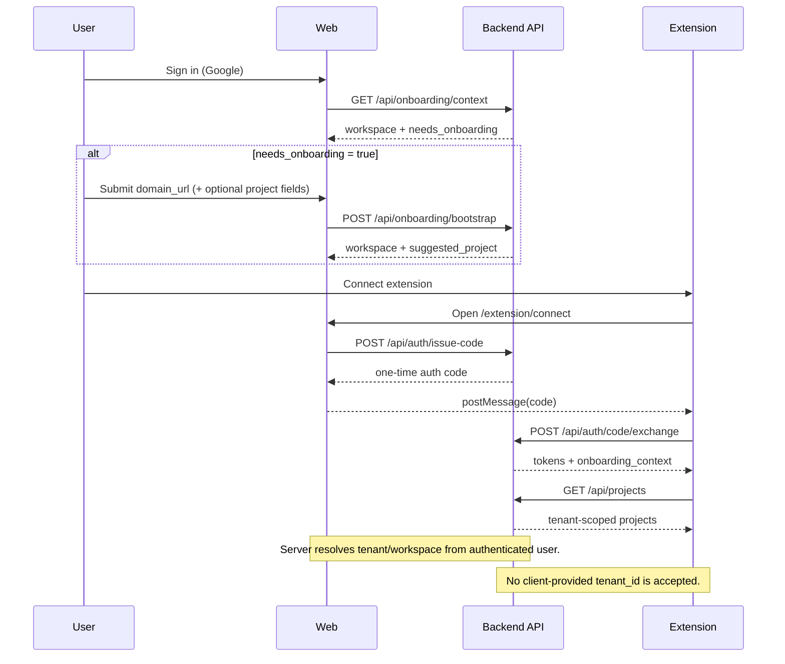

# Onboarding + Extension Handoff Sequence

```mermaid
sequenceDiagram
  participant User
  participant Web
  participant API as Backend API
  participant Ext as Extension

  User->>Web: Sign in (Google)
  Web->>API: GET /api/onboarding/context
  API-->>Web: workspace + needs_onboarding

  alt needs_onboarding = true
    User->>Web: Submit domain_url (+ optional project fields)
    Web->>API: POST /api/onboarding/bootstrap
    API-->>Web: workspace + suggested_project
  end

  User->>Ext: Connect extension
  Ext->>Web: Open /extension/connect
  Web->>API: POST /api/auth/issue-code
  API-->>Web: one-time auth code
  Web-->>Ext: postMessage(code)
  Ext->>API: POST /api/auth/code/exchange
  API-->>Ext: tokens + onboarding_context

  Ext->>API: GET /api/projects
  API-->>Ext: tenant-scoped projects

  Note over Web,API: Server resolves tenant/workspace from authenticated user.
  Note over Ext,API: No client-provided tenant_id is accepted.
```
