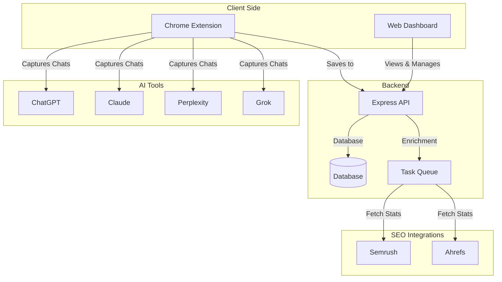

# IntentFlow

IntentFlow is a platform for capturing and organizing AI-driven search intent. It allows you to save conversations from AI tools, turn them into structured maps, and analyze them for SEO and marketing insights.

The system includes a Chrome extension for capturing chats, a web dashboard for analysis, and a backend for storing data and fetching SEO metrics.

## System Architecture



---

## Core Features

### Live Chat Capture
A Chrome extension (Manifest V3) that runs in a side panel. it captures conversation threads from AI providers like ChatGPT, Claude, Perplexity, and Grok as you chat.

### Conversation Mapping
The system automatically turns raw chats into a structured tree:
1. **User Prompt**: The main question or instruction.
2. **Sub-Steps**: The logical sections or search tasks the AI performed.
3. **Sites & Sources**: The websites the AI visited or cited, organized by topic.

### Campaign Management
Organize your research into Campaigns and Versions.
- **Multi-Provider Replay**: Re-run your prompts across different AI tools to compare results.
- **Search History**: Track how your prompts and AI responses change over time.

---

## Technical Stack

| Part | Technology |
| :--- | :--- |
| **Backend** | Node.js, Express, Prisma (PostgreSQL), BullMQ (Redis) |
| **Web App** | React, Vite, Tailwind CSS, Tree Visualization (XYFlow) |
| **Extension** | React, Chrome Extension API (Manifest V3) |

---

## Developer Setup

### Prerequisites
- Node.js (18+) & pnpm
- PostgreSQL (Database)
- Redis (For background tasks)

### 1. Installation
```bash
git clone https://github.com/amogharajsandur/IntentFlow.git
cd IntentFlow
pnpm install
```

### 2. Configuration
Create a `.env` file in the `backend/` folder:

| Key | Description | Required |
| :--- | :--- | :--- |
| `DATABASE_URL` | PostgreSQL connection link | Yes |
| `REDIS_URL` | Redis connection link | Yes |
| `JWT_SECRET` | Security key for user sessions | Yes |
| `OPENAI_API_KEY` | For AI-based suggestions | Optional |
| `SEMRUSH_URL` | For SEO keyword data | Optional |
| `AHREFS_URL` | For site traffic data | Optional |

### 3. Start Developing
```bash
cd backend
npx prisma generate
npx prisma db push
pnpm dev # Starts the API and background workers
```

---

## How It Works (Data Flow)

1. **Capture**: The extension listens to the data coming from AI tools like ChatGPT.
2. **Save**: The extension sends the conversation to the backend.
3. **Process**: The backend breaks the chat down into prompts, sub-queries, and cited websites.
4. **Enrich**: For cited websites, background tasks fetch SEO metrics (like Traffic or Difficulty).
5. **View**: Designers and SEOs can view the results in the web dashboard or as a visual tree.

---

## Common Scripts

| Task | Backend | Web App | Extension |
| :--- | :--- | :--- | :--- |
| **Start Dev** | `pnpm dev` | `pnpm dev` | `pnpm dev` |
| **Build Project** | `pnpm build` | `pnpm build` | `pnpm build` |
| **Database Sync** | `pnpm prisma:push` | N/A | N/A |

---

## Troubleshooting

- **Extension Not Connecting**: Make sure the web app URL is added to the extension's allowed hosts in `manifest.json`.
- **Tasks Not Running**: Check if Redis is active. Background jobs will wait until the worker starts.
- **Re-running Prompts**: The backend records the intent to re-run, but the extension actually opens the tabs to execute them.
