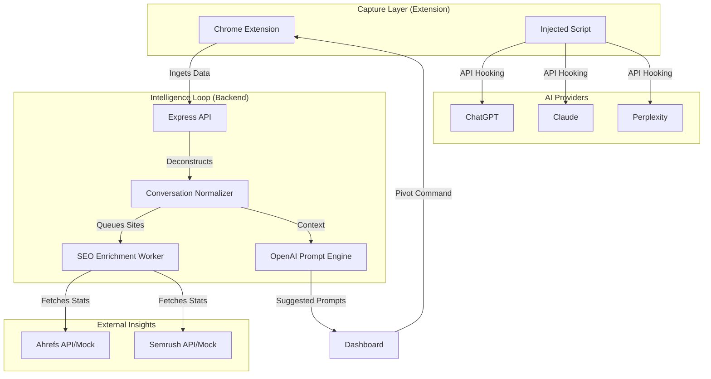

# 🌊 IntentFlow

**IntentFlow** is the ultimate **AI Search Visibility (LLM-SEO)** intelligence platform. It allows enterprises to monitor how their brands and websites are cited by AI search engines (like Perplexity, ChatGPT, and Claude), identify gaps in AI research, and automatically generate prompts to "probe" and influence AI search results.

---

## 🏗 System Architecture

IntentFlow is a modular monorepo designed for high-performance data capture and enrichment.

- **Frontend (`/web`)**: A premium React dashboard for visualizing intent trees and managing campaigns.
- **Backend (`/backend`)**: An Express API with Prisma ORM, PostgreSQL, and BullMQ for background task processing.
- **Extension (`/extension`)**: A Manifest V3 Chrome extension that uses **Scripting Injection** to capture raw AI conversation streams directly from providers.



---

## 🔄 The "Intelligence Loop" (How It Works)

### 1. Injected Capture
Unlike standard network sniffers, IntentFlow **injects code** into the active AI tab. It calls the LLM's internal conversation API (e.g., `/backend-api/conversation` on ChatGPT) to retrieve the full, raw structural data of your chat, including hidden search steps and citations.

### 2. Normalization & Intent Trees
The backend deconstructs the raw JSON into oraganized **Intent Trees**:
- **Prompts**: The user's input.
- **Sub-Queries**: The specific searches the AI performed.
- **Cited Sources**: The websites the AI actually visited and quoted.

### 3. SEO Enrichment
Every source cited by the AI is enriched with data from **Ahrefs** and **SEMrush**. We fetch metrics like:
- **Domain Rating (DR)** & **Traffic**.
- **Keyword Overlap**: Which keywords are shared between the user's intent and the cited site?

### 4. AI-Driven "Pivot" Prompts
Using the context of the current conversation and the missing SEO signals (sites that *should* have been cited but weren't), **OpenAI** generates 2-3 **Prompt Candidates**. These are designed to pivot the AI's research or probe why certain sites were ignored.

### 5. Automated Re-Execution
Users can fire these candidates directly from the dashboard. The extension will open new tabs, load the target LLM, and automatically input the prompt to trigger the next turn in the pipeline.

---

## 🚀 Local Setup

### 1. Prerequisites
- **Node.js** (v18+)
- **Python 3** (for the Mock API)
- **Supabase Account** (PostgreSQL)
- **Upstash Account** (Redis)

### 2. Installation
```bash
git clone https://github.com/sibtain-ahmed/IntentFlow.git
cd IntentFlow
# Install dependencies in root or subfolders
npm install --prefix backend
npm install --prefix web
npm install --prefix extension
```

### 3. Running Development
Start **three** terminals:
1. **Mock API**: `python3 mock_server.py` (Simulates Ahrefs/Semrush)
2. **Backend**: `cd backend && npm run dev` (Runs on port 4000)
3. **Frontend**: `cd web && npm run dev` (Runs on port 5173)

---

## ❓ Troubleshooting

- **CORS Error**: Ensure `VITE_API_BASE_URL` in `web/.env` is `http://localhost:4000`.
- **Port Conflict**: If `5173` is blocked, killing zombie node processes with `lsof -i :5173` usually fixes it.
- **DB Push**: If database errors occur, run `npx prisma db push` in the `backend` folder.

---

## 📜 License
Internal Development - All Rights Reserved.
