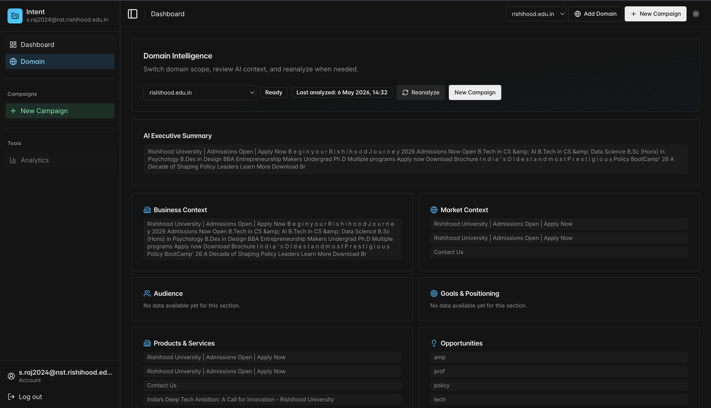
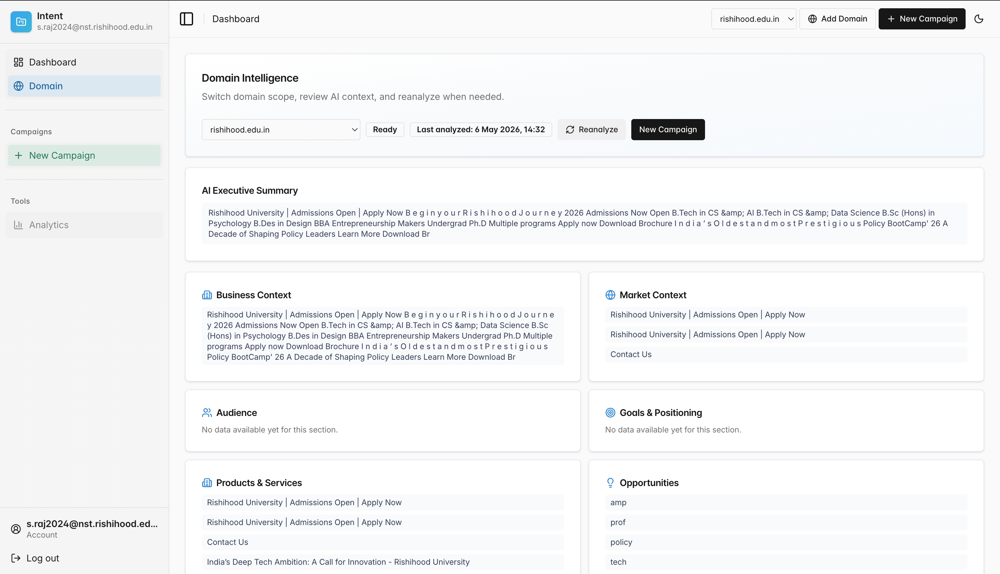

# IntentFlow

## AI SEO Intelligence Platform

IntentFlow is a full-stack intelligence platform that captures invisible user behavior from AI chat providers—ChatGPT, Claude, Perplexity, and Grok—and materializes it into structured, deterministic SEO campaign data.





---

## Table of Contents
- [The Problem](#the-problem)
- [Core Features](#core-features)
- [System Architecture](#system-architecture)
- [Technology Stack](#technology-stack)
- [Project Structure](#project-structure)
- [Data Flow](#data-flow)
- [Database Design](#database-design)
- [System Design Principles](#system-design-principles)
- [Object-Oriented Design](#object-oriented-design)
- [Getting Started](#getting-started)
- [Contributors](#contributors)

---

## The Problem

Traditional SEO tools monitor Google searches. But as users migrate to conversational AI search, those queries—and the sites AI models cite—are invisible to standard analytics. IntentFlow bridges this visibility gap by intercepting live AI streams, parsing them into hierarchical campaign trees, and enriching them with third-party SEO data.

---

## Core Features

| Feature | Description |
|---------|-------------|
| **Multi-Provider Interception** | Captures live streams from ChatGPT, Claude, Perplexity, and Grok simultaneously via a Chrome Manifest V3 extension. |
| **Deterministic Tree Mapping** | Every conversation is materialized into a stable `Prompt → Subquery → Site` tree using deterministic SHA-1 hashing. |
| **Campaign Versioning** | Snapshot campaigns and "refire" them to track how AI-cited sites change over time. |
| **SEO Enrichment** | Background queues (BullMQ) auto-enrich sites with SEMrush and Ahrefs keyword volume, traffic estimates, and rankings. |
| **Lead Intelligence** | Extracts buying-intent signals from raw prompt text and scores users by behavioral intent. |
| **Admin RBAC Dashboard** | Granular, multi-tenant role-based access control with full administrative visibility. |
| **AI Prompt Suggestions** | Uses OpenAI GPT to suggest follow-up prompts based on campaign history. |

---

## System Architecture

IntentFlow is a **monorepo** containing three independently deployable surfaces that communicate over HTTPS via REST APIs and JWT authentication.

```text
┌─────────────────┐      REST / JWT       ┌──────────────────┐
│  CHROME EXTENSION│ ◄──────────────────► │     BACKEND      │
│  (React + MV3)   │                      │  (Node.js/Express)│
└─────────────────┘                      └────────┬─────────┘
         │                                        │
         │     WebSocket / postMessage            │  Prisma ORM
         ▼                                        ▼
┌─────────────────┐                      ┌──────────────────┐
│  WEB DASHBOARD  │ ◄──────────────────► │   PostgreSQL     │
│ (React 19 + Vite)                      │    + Redis       │
└─────────────────┘                      └──────────────────┘
```

### Surface Overview

| Surface | Responsibility | Key Technologies |
|---------|----------------|------------------|
| **Extension** | Injects MAIN-world content scripts to intercept AI provider streams; side-panel UI for real-time visualization. | Chrome MV3, CRXJS, React |
| **Backend** | Ingests raw events, materializes campaign trees, orchestrates enrichment jobs, enforces RBAC. | Express.js, Prisma, BullMQ |
| **Web Dashboard** | Campaign graph exploration, analytics, admin controls, onboarding. | React 19, Vite, XYFlow, Recharts |

---

## Technology Stack

| Layer | Technology |
|-------|------------|
| **Backend Runtime** | Node.js 20+, TypeScript |
| **Web Framework** | Express.js 4 |
| **Database** | PostgreSQL (via Prisma ORM) |
| **Queue / Jobs** | BullMQ on Redis |
| **Authentication** | JWT (access) + Refresh tokens (DB-backed) |
| **Frontend** | React 19, Vite, Tailwind CSS, Shadcn UI / Radix UI |
| **Visualization** | XYFlow (campaign trees), Recharts (analytics) |
| **Extension Build** | Chrome MV3, CRXJS plugin, Vite |
| **Validation** | Zod (DTO schema validation) |
| **External APIs** | OpenAI GPT, SEMrush, Ahrefs |
| **Package Manager** | pnpm (workspace-aware) |

---

## Project Structure

The repo is a flat monorepo: `backend/`, `web/`, and `extension/` are siblings at the project root. Each app follows the same broad pattern — bootstrap/runtime wiring under `app/`, domain logic under `modules/` or `features/`, runtime adapters under `infrastructure/` (where applicable), and reusable primitives under `shared/`.

```text
intentflow/
├── backend/                       # Node.js + Express + Prisma + BullMQ
│   ├── prisma/                    # Prisma schema + migrations
│   ├── scripts/                   # Operational scripts (seed, backfill, admin bootstrap)
│   └── src/
│       ├── app/                   # Bootstrap & wiring
│       │   ├── server.ts          # Process entry (started by `npm run dev` / `start`)
│       │   ├── app.ts             # Express factory
│       │   ├── index.ts           # Public type re-exports
│       │   ├── config/            # Env loading + typed config object
│       │   └── loaders/           # Database + Express loaders chained on boot
│       ├── modules/               # Feature domains (Routes → Controller → Service → Repository)
│       │   ├── account/  auth/  campaign/  domain/  user/
│       │   ├── analytics/  onboarding/  example/
│       │   └── lead-intelligence/
│       ├── infrastructure/        # External-system adapters
│       │   └── queue/             # BullMQ queues, workers, SEMrush/Ahrefs clients
│       └── shared/                # Cross-cutting primitives
│           ├── core/              # BaseController/BaseService/BaseRepository, ApiResponse, HttpException
│           ├── middlewares/       # auth, RBAC, request-logger, error
│           ├── types/             # Ambient .d.ts (express, cors)
│           └── utils/             # logger, prisma, bcrypt, tokens, telemetry
│
├── web/                           # React 19 + Vite dashboard
│   └── src/
│       ├── main.tsx               # Vite entry (referenced by index.html)
│       ├── index.css              # Global styles
│       ├── app/                   # App shell
│       │   ├── App.tsx            # Router composition
│       │   ├── App.css            # App-level styles
│       │   └── app-layout.tsx     # Authenticated shell + outlet context
│       ├── features/              # Domain features (each owns its pages/components/hooks)
│       │   ├── admin/             # admin dashboard, users, events, signals + AdminRoute guard
│       │   ├── analytics/         # charts/ + hooks/ for dashboard/prompt/website analytics
│       │   ├── auth/              # sign-in, auth-callback, extension-connect
│       │   ├── campaigns/         # campaign list/graph/layout pages + chat history & dialogs
│       │   ├── dashboard/         # main dashboard page
│       │   ├── onboarding/        # onboarding flow
│       │   └── workspace/         # workspace/domain selection
│       └── shared/                # Reusable UI/hooks/lib
│           ├── components/        # ui/ (shadcn primitives), d3/ (chart frame), layouts/
│           ├── hooks/             # use-mobile, use-project-data, use-web-analytics
│           └── lib/               # auth client, analytics client, utils
│
└── extension/                     # Chrome MV3 extension (Vite + CRXJS)
    ├── manifest.json              # Background + content-script registration
    └── src/
        ├── main.tsx               # Side-panel entry (referenced by index.html)
        ├── index.css              # Side-panel styles
        ├── background/            # Service worker orchestration
        │   └── index.ts           # Manifest service_worker target
        ├── content-scripts/       # Per-provider stream interception (registered in manifest)
        │   ├── chatgpt/   claude/   perplexity/   grok/
        │   │   ├── streamContent.ts   # ISOLATED-world relay
        │   │   └── streamMain.ts      # MAIN-world fetch/SSE patch
        │   └── web-bridge/        # Web app ↔ extension bridge for localhost dev
        ├── ui/                    # Side-panel React surface
        │   ├── App.tsx            # Hash router + protected routes
        │   ├── pages/             # AuthPage, Dashboard, WorkflowPage, etc.
        │   ├── components/        # Header, badges, ui/ shadcn primitives
        │   └── hooks/             # use-extension-analytics
        └── shared/                # Cross-runtime primitives (background + content + UI)
            ├── lib/               # api client, auth, provider-stream-registry, workflow VM
            └── data/              # mock fixtures
```

### Path Aliases

Every app exposes a single `@/*` (web, extension) or richer namespaced aliases (`@app/*`, `@modules/*`, `@infrastructure/*`, `@shared/*` — backend) so cross-folder imports remain stable as files move within the new layout.

---

## Data Flow

### End-to-End Ingestion Pipeline

1. **Intercept**: The extension injects a MAIN-world script into ChatGPT/Claude/etc., bypassing CSP via `manifest.json` declarations. It intercepts SSE/streaming HTTP responses.
2. **Parse**: Prompts, internal search queries, and cited websites are extracted from the raw token stream.
3. **Relay**: Data is relayed from the isolated content script to the background service worker via `chrome.runtime` ports.
4. **Ingest**: The backend API (`POST /campaigns/:id/ingest-turn`) receives a structured JSON payload.
5. **Materialize**: `CampaignService.ingestTurn()` normalizes the data, resolves the active `CampaignVersion`, and builds the `PromptNode` tree (root → subqueries → sites).
6. **Enrich**: SEMrush/Ahrefs jobs are pushed to BullMQ for asynchronous keyword/traffic enrichment.
7. **Signal**: `LeadIntelligenceService` extracts buying-intent signals fire-and-forget.
8. **Visualize**: The extension side-panel and web dashboard receive the updated tree in real time.

### Campaign Versioning & Refiring
- **v1** is created automatically upon first ingestion.
- Users can **refire** a campaign, creating a **v2** snapshot to compare how AI responses drift over time.

---

## Database Design

### Core Entities

| Table | Purpose |
|-------|---------|
| `User` | Platform users, auth credentials, app roles. |
| `Tenant` | Organization/account boundary. |
| `TenantMember` | Join table linking users to tenants with roles (owner/member). |
| `Campaign` | An SEO campaign linked to a tenant. |
| `CampaignVersion` | Point-in-time snapshot of a campaign. |
| `CaptureSession` | One AI chat conversation. |
| `CaptureTurn` | One prompt-response exchange within a session. |
| `PromptNode` | **Self-referencing tree** node: prompt, subquery, site, or generated. |
| `SemrushSnapshot` | Cached SEO data (24h TTL). |
| `LeadSignal` | Extracted intent signals from a turn. |

### The Campaign Tree (Adjacency List)
The central data model is a self-referencing `PromptNode` tree:

| Node Type | Parent | Example Content |
|-----------|--------|-----------------|
| `prompt` | `null` (root) | *"best SEO tools 2026"* |
| `subquery` | `prompt` | *"top seo software"* |
| `site` | `subquery` | `ahrefs.com` |
| `generated` | `prompt` (sibling) | *"compare seo pricing"* |

All internal references use **deterministic SHA-1 hashes** (`provider + turn_id + query_key + site_name + url`) instead of random UUIDs to guarantee idempotency across multiple ingestion runs.

---

## System Design Principles

| Principle | Implementation |
|-----------|----------------|
| **N-Tier Layering** | Strict 4-layer backend: Routes → Controller → Service → Repository. Swapping the database only touches the Repository layer. |
| **Multi-Tenancy** | Every record carries a `tenant_id`. Row-level security is enforced in the Repository layer; no tenant can access another's data. |
| **Event-Driven Processing** | Heavy enrichment tasks (SEMrush, Ahrefs, NLP) are offloaded to BullMQ workers using the Producer-Consumer pattern. |
| **Idempotency** | `ingestTurn()` checks `request_id` + `turn_exchange_id` before writing, preventing duplicates from network retries. |
| **Caching** | SEMrush/Ahrefs results are cached in `SemrushSnapshot` with a 24-hour TTL to prevent expensive repeated API calls. |
| **RBAC** | Dual-role system: **App Role** (`admin` vs `user`) and **Tenant Role** (`owner` vs `member`), enforced by middleware on every protected route. |
| **DTO Validation** | All incoming API bodies are validated with Zod schemas before reaching controllers. |

---

## Object-Oriented Design

IntentFlow leverages TypeScript's full OOP capabilities:

- **Abstraction**: `BaseController`, `BaseService`, and `BaseRepository` define structural contracts for the entire backend.
- **Encapsulation**: `CampaignService` hides complex deduplication, versioning, and mapping logic behind private methods; the public API remains simple (`ingestTurn`, `createCampaign`, `getActiveTree`).
- **Inheritance**: All concrete controllers, services, and repositories extend their respective abstract base classes.
- **Interfaces**: Strict structural typing via `ApiSuccessResponse<T>`, `CanonicalNodeMetadata`, `MaterializedSubquery`, etc.
- **Polymorphism**: `ApiResponse.success<T>()` is method-polymorphic based on generic type `T`. The extension uses runtime polymorphism for provider-specific stream interception strategies.
- **Singleton Pattern**: Services and controllers are instantiated once at module load to prevent redundant DB connections.
- **Dependency Injection**: `CampaignService` receives its repository via constructor injection, enabling isolated unit testing with mock repositories.
- **Factory Pattern**: `ApiResponse` factory standardizes all controller response envelopes.
- **Strategy Pattern**: Each AI provider implements a distinct content-script strategy under `extension/src/content-scripts/<provider>/` (`chatgpt/streamContent.ts`, `claude/streamContent.ts`, etc.) behind a uniform event-posting contract.

---

## Getting Started

### Prerequisites
- Node.js 20+
- pnpm
- PostgreSQL 15+
- Redis 7+

### Installation

```bash
# 1. Clone the monorepo
git clone https://github.com/your-org/intentflow.git
cd intentflow

# 2. Install dependencies
pnpm install

# 3. Configure environment variables
cp backend/.env.example backend/.env
# Edit .env with your DATABASE_URL, REDIS_URL, JWT_SECRET, and API keys.

# 4. Run database migrations
cd backend && npx prisma migrate dev && cd ..

# 5. Start each surface in its own terminal
cd backend && npm run dev      # Express API on :3500
cd web && npm run dev          # Vite dashboard on :5173
cd extension && npm run build  # Build, then load `extension/dist/` unpacked
```

### Development URLs
- **Web Dashboard**: `http://localhost:5173`
- **Backend API**: `http://localhost:3500`
- **Extension**: Load `extension/dist/` as an unpacked extension in `chrome://extensions`.

---

## Contributors

| Name | Role | Key Contributions |
|------|------|-------------------|
| **Sibtain Ahmed Qureshi** | Project Lead & Architect | Monorepo structure, materialization engine, Prisma schema architecture |
| **Abhishek Verma** | Strategy & Systems Design | Lead intelligence framework, system governance, RBAC security architecture |
| **Amogha Raj Sandur** | DevOps & Quality Assurance | CI/CD alignment, refactoring, technical documentation standards |
| **Mohammed Yaseen** | Full-Stack Engineering | Mock ecosystem, cross-surface sync, onboarding & analytics flows |
| **Saksham** | Backend & Data Pipelines | SEMrush/Ahrefs bridges, BullMQ optimization, NLP intent extraction |
| **Saumya** | Frontend & UX Engineering | XYFlow integration, Compact Tree Explorer, design system maintenance |

---
Live Deployment URLs:
<br>
1.Frontend: https://intentflow-frontend-production.up.railway.app
<br>
2.Backend: https://intentflow-backend-production.up.railway.app/api/auth/google/callback
<br>
<p align="center">
  <sub>© 2026 IntentFlow. Confidential Project Documentation.</sub>
</p>
